<picture>
  <source media="(prefers-color-scheme: dark)" srcset="assets/hero-dark.svg">
  
</picture>

<p>
  
  
  
  
  
</p>

Two scripts for renaming a semantic model out from under a report that is already built. One **inventories every field reference** in a PBIR report; the other **repoints them from a CSV** — projections, sorts, conditional formatting, filters and bookmarks — in a single pass.

| | | |
|---|---|---|
| 🔎 | **[Step 1 · Inventory what is bound](#-step-1)** | Export every semantic binding, and every scalar value, to CSV. Read-only, and the safe way to build the map. |
| 🔁 | **[Step 2 · Write the map, run it once](#-step-2)** | One command, no mode flags. The deep scan always runs and the changes are always written. |
| ⚠️ | **[Step 3 · What it does not reach](#-step-3)** | The mapping rules, the locations it rewrites, and the ones it silently leaves behind. |

> [!CAUTION]
> `apply_field_remap.py` **writes your report files in place, immediately, with no backup and no preview mode.** Commit the `.Report` folder — or copy it — before you run it. The inventory script in step 1 is read-only and safe to run at any time.

---

## 🎯 The three problems it solves

| 1️⃣ Renaming in the model breaks the report silently | 2️⃣ Find-and-replace is not safe here | 3️⃣ The damage hides in bookmarks |
|---|---|---|
| Rename a column in the semantic model and every visual bound to it breaks. Power BI Desktop will not do the rename for you, and nothing tells you how many places are affected. | A field reference is not one string. It is a `SourceRef.Entity`, a `Property`, a `queryRef` that has to agree with both, and a `selector.metadata` string that encodes the same pair again. Replacing the table name in a text editor leaves `queryRef` disagreeing with the field it names. | A remap that only fixes visuals looks like it worked. The report opens, the pages render, and the breakage surfaces the first time somebody clicks a bookmark. |
| A single read-only pass over this repo's own report found **257 bindings across 187 JSON files** — the list you actually have to act on, before touching anything. | The script updates the pair and rebuilds **`queryRef` and `selector.metadata` from it**, so the derived strings cannot drift from the reference they describe. | The recursive scan is unconditional for exactly this reason. On the run below it found **119 changes rather than 54**, and **62 of the extra 65 were inside 12 `.bookmark.json` files**. |

---

<a id="-step-1"></a>
<picture>
  <source media="(prefers-color-scheme: dark)" srcset="assets/section-inventory-dark.svg">
  
</picture>

```powershell
python export_report_json_inventory.py "D:\path\to\MyReport.Report"
```

<picture>
  <source media="(prefers-color-scheme: dark)" srcset="assets/cast-inventory-dark.svg">
  
</picture>

Read-only. Writes two CSVs to `<report_dir>/inventory_export`, or wherever `--output-dir` points. A **relative** `--output-dir` is resolved against the report folder here, not your working directory; an absolute one is used as given.

| | File | What it is for |
|---|---|---|
| 🎯 | **`FieldBindings.csv`** | One row per semantic reference, with the `entity` and `property` you will paste into the map. Carries `page_id`, `visual_id`, `context_type`, `json_path`, `query_ref`, `native_query_ref`, `selector_metadata`, `display_name` and `filter_name`, so you can tell *which* visual on *which* page a reference belongs to before renaming it. |
| 🧾 | **`AllScalars.csv`** | Every scalar value in the report, one row per JSON leaf, with its `json_path`, `key`, `value_type` and `parent_path`. Large — 10,300 rows for the report above — and the tool of last resort when a field reference is somewhere the binding export does not model. |

The five `context_type` values in `FieldBindings.csv`, and what the report above contained:

| `context_type` | Rows | Where it lives |
|---|---|---|
| `visual_projection` | 150 | a field on a visual — the ordinary case |
| `visual_filter` | 56 | a filter attached to one visual |
| `visual_selector` | 30 | conditional formatting keyed to a field by `selector.metadata` |
| `visual_sort` | 15 | a visual's sort order |
| `page_filter` | 6 | a page-level filter |

> [!TIP]
> `FieldBindings.csv` is almost the mapping file already. Pull the distinct `entity` and `property` pairs into a sheet, add `To table` and `To col`, and leave the rows you do not want touched blank — blank means keep.

---

<a id="-step-2"></a>
<picture>
  <source media="(prefers-color-scheme: dark)" srcset="assets/section-remap-dark.svg">
  
</picture>

`map.csv` needs four columns. The header is matched **exactly**, and the capitalisation is inconsistent — copy it rather than typing it:

```csv
From Table,From col,To table,To col
Fact,user_email,fct_BigQueryJobs,user_email
Fact,region,fct_BigQueryJobs,region
dim_Date,Date,,
```

| Rule | Effect |
|---|---|
| blank `To table` **or** blank `To col` | row skipped, original kept — this is how you say "leave this one alone" |
| `From` identical to `To` | row skipped as a no-op, so it never appears in the change log |
| blank `From Table` or `From col` | row ignored entirely |
| the same `(From Table, From col)` twice | last row wins; the map is a dictionary keyed on that pair |

A UTF-8 BOM on the file is handled (it is read as `utf-8-sig`), so a CSV saved from Excel is fine.

```powershell
python apply_field_remap.py "D:\path\to\MyReport.Report" --map "C:\path\to\map.csv"
```

<picture>
  <source media="(prefers-color-scheme: dark)" srcset="assets/cast-apply-dark.svg">
  
</picture>

There is one mode. Every run does the full recursive scan and writes its changes; there is no flag to preview first and no flag to turn the deep scan off.

> [!IMPORTANT]
> **Why the deep scan is not optional.** It used to be opt-in, and on a real report the difference was not marginal:
>
> | Same 16 rules, same report | Changes | Files rewritten |
> |---|---|---|
> | targeted passes only | 54 | 26 |
> | with the recursive scan | **119** | **36** |
>
> The two sets do not overlap at all — every one of the extra 65 is a location the targeted passes never visit, and **62 of them are inside 12 `.bookmark.json` files**. The bookmark pass reads only `explorationState.filters.byExpr`; each bookmark's saved per-visual state under `explorationState.sections.*.visualContainers.*` is invisible to it. Left off, your bookmarks keep pointing at the old names.

### Output

Both CSVs go to `--output-dir`, defaulting to `<report_dir>/remap_output`. Unlike the inventory script's, **this path is used as given** — a relative path lands in your working directory.

| File | Contents |
|---|---|
| `remap_applied.csv` | one row per change written: file, `context_type`, `json_path`, old and new entity/property, and the old and new `queryRef` / `selector.metadata` where those applied |
| `remap_unresolved.csv` | field references found in the report that your map did not cover, **deduplicated to one row per `(entity, property)`** — so the `file_path` and `json_path` on the row are the first place it was seen, not the only one |

`remap_unresolved.csv` is always written, as a header-only file when there is nothing to report. Its row count is the honest measure of how complete your map is: 71 unique pairs went uncovered in the run above, because the map deliberately only renamed one table.

Open the report in Power BI Desktop afterwards and check the pages and bookmarks. Nothing validates the new names against the semantic model.

---

<a id="-step-3"></a>
<picture>
  <source media="(prefers-color-scheme: dark)" srcset="assets/section-reference-dark.svg">
  
</picture>

Everything below is reference — read it when you need it.

### What gets rewritten

Only `<report_dir>/definition/**/*.json` is ever read or written. `definition.pbir`, `.platform` and everything under `StaticResources` are untouched.

| | Location | What changes |
|---|---|---|
| 📊 | `visual.query.queryState.*.projections[].field` | `SourceRef.Entity` and `Property`, and **`queryRef` rebuilt** as `entity.property` |
| 🎛️ | `visual.query.queryState.*.fieldParameters[].parameterExpr` | the entity/property pair |
| ↕️ | `visual.query.sortDefinition.sort[].field` | the entity/property pair |
| 🎨 | `visual.objects.*[].selector.metadata` | the string **rebuilt** as `entity.property` |
| 🧮 | `visual.objects` and `visual.visualContainerObjects`, recursively | field objects nested inside expressions — conditional-formatting fill rules and the like |
| 🔻 | `filterConfig.filters[]` on visuals, pages and `report.json` | the filter's `field`, plus `Where[]` properties and the matching `From[].Entity` |
| 🔖 | `explorationState.filters.byExpr[].expression` in bookmarks | the entity/property pair |
| 🌐 | anywhere else in the file | any field object, plus a sibling `queryRef` if the container has one — the recursive scan, which always runs |

A field object is recognised as `Column`, `Measure`, `HierarchyLevel` or `Aggregation` carrying both an `Expression.SourceRef.Entity` and a `Property`.

<a id="-things-that-will-bite-you"></a>
### ⚠️ Things that will bite you

| | |
|---|---|
| **A wrong folder looks like a clean run** | The script requires the folder to end in `.Report` but never checks that `definition/` exists inside it. Point it at the wrong level and you get `Changes applied: 0` and exit code 0 — indistinguishable from "the map matched nothing". The inventory script does check, and exits 1. Run that first and you cannot make this mistake. |
| **Chained mappings apply transitively** | The recursive scan re-walks fields the targeted passes already remapped, so a map containing both `A → B` and `B → C` can land on `C`. Map to final names in one pass; never chain. |
| **`remap_unresolved.csv` misses two contexts** | Unresolved references are logged from projections, field parameters, filters, bookmarks and nested object fields — but **not** from `sort` or `selector.metadata`. A stale sort or a stale conditional-formatting selector will not appear there. `FieldBindings.csv` from step 1 does list both. |
| **Nothing validates against the model** | The script does not open the semantic model. Map a field to a name that does not exist and it writes it happily; you find out in Desktop — and the exit code is 0 either way, so there is nothing for a CI step to branch on. |

### 🧪 Reproducing the figures on this page

Every number here came from running both scripts against the report in this repo, with a 16-rule map that renames the `Fact` table. Nothing was hand-counted, and the report itself was not modified — the runs were against a copy, which is also how you should try this.

```powershell
$src = "..\Bigquery & Dbt Cost Observability\powerbi\BigQuery dbt Cost Observability.Report"
Copy-Item -Recurse $src "$env:TEMP\t.Report"

python export_report_json_inventory.py "$env:TEMP\t.Report"          # 187 files, 257 bindings
python apply_field_remap.py "$env:TEMP\t.Report" --map map.csv       # 36 files, 119 changes, 71 unresolved
```

Build `map.csv` from the `Fact` rows of `FieldBindings.csv`, setting `To table` to any new name and leaving `To col` as the original column. The 54-change figure in the comparison above is what the targeted passes alone produced before the recursive scan became unconditional.

### 📁 Repo layout

```
PBIR Field Remap Toolkit/
├─ apply_field_remap.py                the remap itself, one mode, writes in place
├─ export_report_json_inventory.py     read-only binding + scalar export
├─ SKILL.md                            agent instructions for running the workflow
└─ assets/                             light/dark SVGs and the captured runs
```

### 🤖 Using it through an agent

[`SKILL.md`](SKILL.md) is an agent skill describing the same workflow: it takes a `report_folder` and a `mapping_csv` and validates both. Because the script writes immediately, the skill's safety gate requires confirming the report folder is committed or backed up first, and stops if that cannot be confirmed.

<sub>Part of <a href="../README.md">methunt/PowerBi</a> · Apache-2.0</sub>
